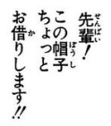
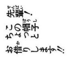
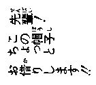
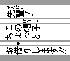
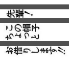
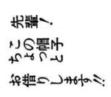
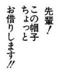

### Dependencies: 
OpenCV, numpy

### Instruction: 
- install opencv, numpy if you haven't already  
- put removeFurigana.py in your folder
- give it a read (I put detailed comments in the file)
- give it 2 parameters: your image path and result image path 
- profit???

### Usage: 
    import removeFurigana 

    removeFurigana.saveResultImage("images/original.png", "result.png")  

### Steps (in images): 
 
  

  

  

  

  

  

  

